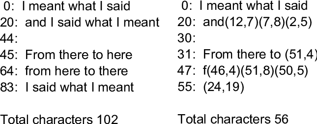
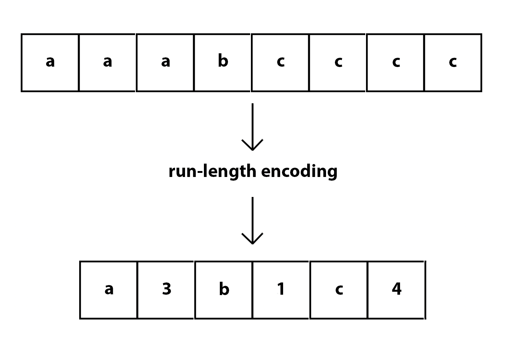
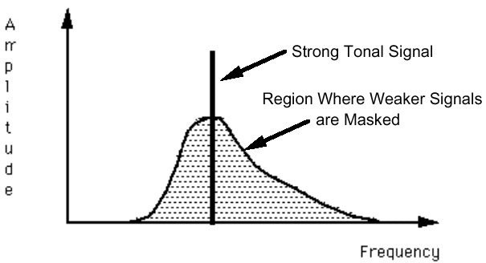
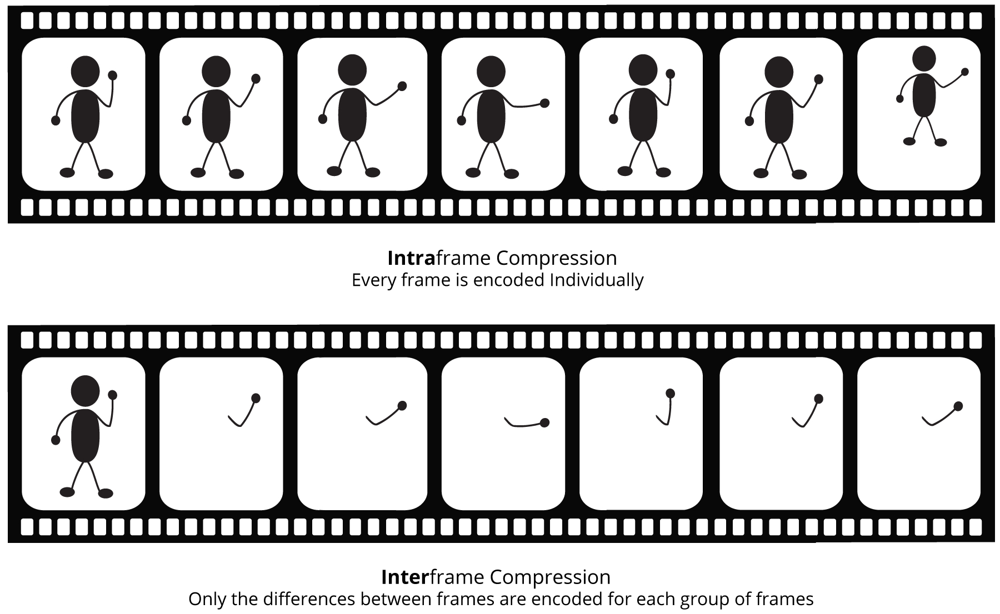

# Compressão: O Que Torna a Tecnologia Moderna Viável

# Introdução

Em um mundo cada vez mais dependente da tecnologia, arquivos digitais são a espinha dorsal da informação que circula pela internet. No entanto, apesar de parecerem mágicos, assim como computadores no geral, arquivos são apenas uma sequência de número representados por *bits* (dígitos binários). Esses bits são armazenados de maneira sequencial, precedidos por um cabeçalho repleto de informações, também representadas numéricamente, que dão significado a essa sequência de bits e a identificam como um arquivo. Esta composição, essencialmente simples, tem um papel fundamental na nossa vida digital.

A necessidade de transferir arquivos pela internet de forma rápida e eficiente e o constante desejo de economizar espaço de armazenamento impulsionaram uma área crucial da ciência da computação: a compressão de dados. Compressão, como o próprio nome sugere, é o processo de reduzir o tamanho de um arquivo, ou seja, reduzir a quantidade de números necessários para o representar. Esta prática tem se tornado cada vez mais essencial em nosso cotidiano digital, tornando possível a transmissão veloz de dados e a otimização dos recursos de armazenamento.

Neste artigo, exploraremos o mundo da compressão de arquivos, explorando os tipos e métodos de compressão e como eles são usados no dia a dia. Afinal, compreender a compressão é compreender a eficiência por trás do funcionamento do nosso mundo digital.

# Tipos de Compressão

A compressão de dados pode ser feita de diversas maneiras diferentes. Para alcançar esse objetivo, existem duas abordagens fundamentais, cada uma com suas características únicas e aplicações específicas. Nesta seção, entenderemos e diferenciaremos os dois principais tipos de compressão: *lossless compression* (compressão sem perda) e *lossy compression* (compressão com perda). Cada uma dessas abordagens desempenha um papel crucial no mundo da tecnologia da informação, moldando a maneira como armazenamos, transmitimos e utilizamos os dados digitais.

### *Lossless Compression*

A compressão sem perdas é um método que busca reduzir o tamanho de um arquivo sem comprometer a qualidade ou a integridade dos dados. Em outras palavras, após a compressão e a subsequente descompressão, o arquivo recuperado será idêntico ao original. Isso é fundamental em situações em que a exatidão dos dados é crítica, como em arquivos de texto e códigos fonte, apesar de também ser usado em outros tipos de arquivo. 

Este tipo de compressão funciona identificando padrões repetitivos ou redundâncias nos dados e substituindo esses padrões por representações mais compactas. Um paralelo a isso seria transformar a conta matemática $5*5*5*5*5*5$ em $5^6$

### *Lossy Compression*

Em contraponto, a compressão com perdas é uma técnica que prioriza a redução significativa do tamanho do arquivo em troca de uma perda controlada de qualidade. Esse tipo de compressão é amplamente empregado em mídias como imagens, áudio e vídeo e muita vezes abusado em serviços de *streaming* como Youtube e Twitch, onde há necessidade de economia de largura de banda. Isso se dá devido ao fato de que, nesses caso, pequenas perdas na qualidade podem ser aceitáveis em troca de tamanhos de arquivo muito menores.

Em compressão com perdas, as informações consideradas menos importantes ou imperceptíveis para os sentidos humanos são descartadas ou representadas de forma mais compacta. Para isso ser realizado com sucesso são usados diversos conceitos da psicofísica, uma área da psicologia que estuda estimulos físicos e as respostas psicológicas e sensações que eles produzem.

# Compressão de Propósito Geral

## DEFLATE

Um dos algoritmos mais amplamente adotados para alcançar a compressão sem perdas é o algoritmo Deflate. Este algoritmo é uma peça fundamental nos formatos de arquivo .zip, amplamente utilizado no ambiente Windows, e .gz, uma escolha comum em sistemas Linux. O algoritmo Deflate combina dois algoritmos: o Huffman Coding e o LZSS (Lempel-Ziv-Storer-Szymanski), descendente do popular LZ77. Nesta seção, exploraremos em detalhes como o algoritmo Deflate opera, explicando os dois algoritmos que o formam.

### *Huffman Coding*

*Huffman Coding* é uma técnica de *prefix coding* (codificação de prefixo), ou seja, nenhum código gerado por ela é prefixo de outro código. Por exemplo, se o código 001 foi gerado, não existirá nenhum outro código que comece com 001. Esta técnica opera com base no princípio de atribuir códigos de comprimento variável a cada caractere (representado por um *byte*) com base em sua frequência de ocorrência nos dados a serem comprimidos.

O processo de codificação Huffman começa atribuindo pesos a cada caractere, representando suas frequências relativas. Os dois elementos com pesos mais baixos são selecionados e combinados em nós de uma árvore binária, onde o ramo esquerdo é rotulado com 0 e o direito com 1. Esse processo continua até que todos os elementos estejam incorporados à árvore, resultando em uma estrutura hierárquica conhecida como "árvore de Huffman". Com isso, para encontrar o código de um determinado caractere, basta concatenar os bits equivalentes ao caminho até seu nó.

[Construção da árvore de Huffman](https://commons.wikimedia.org/wiki/File:Huffman_huff_demo.gif)

A utilidade da codificação Huffman para a compressão está na sua capacidade de gerar códigos mais curtos para elementos que ocorrem com frequência e códigos mais longos para aqueles menos comuns, o que efetivamente reduz o tamanho geral dos dados codificados. Além disso, a árvore de Huffman em si pode ser usada para decodificar os dados comprimidos de maneira eficiente.

### LZSS

O algoritmo LZSS é uma evolução do LZ77, que se enquadra na categoria das técnicas de *dictionary coding*. O LZSS é um algoritmo de compressão que se baseia na ideia de manter constantemente um registro de uma quantidade pré-determinada de caracteres anteriores, conhecido como "janela deslizante".

A principal funcionalidade do LZSS é identificar sequências de caracteres que são idênticas a aquelas já presentes na janela deslizante. Quando uma correspondência é encontrada, a sequência repetida é substituída por uma referência a essa ocorrência. Essa referência é composta por dois elementos essenciais: a distância entre a sequência duplicada e a original dentro da janela deslizante, e a quantidade de caracteres duplicados.

É importante destacar que essa parte do algoritmo, ou seja, a busca por correspondências e a criação de referências, é a parte mais computacionalmente cara do DEFLATE e, como resultado, a otimização dessa parte do algoritmo é crítica para a eficiência geral da compressão.

Devido à complexidade e à importância da implementação dessa funcionalidade, a forma como o LZSS é implementado pode variar consideravelmente de uma implementação para outra. Diferentes implementações podem utilizar estratégias diferentes para otimizar o processo de busca por correspondências e a criação de referências, o que pode resultar em desempenho e eficiência variados. Portanto, essa é a parte do algoritmo DEFLATE que está mais sujeita a alterações de acordo com a implementação específica e os objetivos de compressão desejados.

[Codificação por LZSS](https://www.researchgate.net/figure/LZSS-Encoding-Example_fig1_224264427)

# Compressão de Imagem

## PNG

O formato de imagem PNG, amplamente conhecido por sua capacidade de suportar transparência em imagens, é outro exemplo em que há uso de *lossless compression*. Inclusive, assim como ZIP e GZIP, este formato também faz uso do algoritmo DEFLATE, que é aplicado em cada canal de cor da imagem (vermelho, verde e azul). No entanto, a aplicação dessa técnica em imagens é um processo complexo devido à natureza visual dos dados, que não apresenta redundâncias tão evidentes quanto em texto.

Para superar esse desafio, o PNG emprega uma abordagem peculiar. Além do uso do algoritmo de compressão DEFLATE, mencionado na seção anterior, o PNG incorpora um mecanismo adicional. Esse mecanismo envolve a aplicação de um filtro que o algoritmo considera apropriado em cada canal de cor, para destacar padrões na imagem e, assim, forçar a criação de redundâncias artificiais. A ideia por trás disso é tornar os dados da imagem mais suscetíveis à compressão eficiente pelo algoritmo DEFLATE.

Em outras palavras, o filtro aplicado durante a compressão do PNG visa criar uma versão modificada da imagem que contenha mais informações sobre a estrutura e os padrões da imagem, tornando-a mais comprimível. É importante notar que a escolha do filtro é determinada pelo algoritmo do PNG com base em uma heurística, ou seja, uma estimativa aplicada na imagem em questão.

No entanto, embora a abordagem do PNG para compressão de imagens seja eficaz em termos de preservação da qualidade, ela também tem suas desvantagens. Assim como o algoritmo DEFLATE, os processos de compressão e descompressão do PNG tendem a ser relativamente lentos, especialmente em comparação com outros formatos de imagem mais rápidos, como o JPEG. Portanto, a escolha do formato de imagem a ser utilizado depende das necessidades específicas do usuário em relação à qualidade, tamanho do arquivo e desempenho.

## JPEG

No mundo da compressão de imagens, o JPEG é, provavelmente, o formato mais renomado. Sua popularidade se deve, em grande parte, à sua eficiência em reduzir o tamanho de arquivos de imagem sem comprometer significativamente a qualidade visual. O segredo por trás da eficácia do JPEG reside em sua capacidade de explorar as nuances da nossa visão.

Nossos olhos são órgãos altamente sensíveis à luz, e, portanto, somos muito mais perceptíveis às variações no nível de iluminação (luminância) em uma imagem do que às variações de cor (crominância). O JPEG inteligentemente usa essa característica da nossa percepção visual para criar imagens compactas por meio de cinco etapas: *color space conversion*, 

### *Color Space Conversion*

A primeira etapa da compressão é a conversão do espaço de cores (*color space conversion*). Cada pixel de uma imagem é composto por três elementos: o nível de vermelho (R), o nível de verde (G) e o nível de azul (B), que juntos determinam a cor de cada pixel. Nesta etapa, esses três elementos de cor são utilizados para encontrar três novos valores: luminância (Y), crominância vermelha (Cb), e crominância azul (Cr). 

O resultado dessa etapa é que os pixels da imagem são agora representados por esses três novos elementos (Y, Cb e Cr) em vez dos valores originais de vermelho, verde e azul. O importante a notar é que os pixels formados com esses novos elementos são equivalentes em termos de informação visual. Isso significa que a conversão é reversível, e a imagem pode ser restaurada para o seu espaço de cores original sem perda de informações

A conversão para o espaço de cores YCbCr é crucial no processo de compressão JPEG, uma vez que permite que as informações de crominância (Cb e Cr) sejam quantificadas de forma mais agressiva do que a luminância (Y). Isso é possível porque nossos olhos são menos sensíveis a variações de cor em comparação com variações de brilho. Portanto, ao explorar essa característica da visão humana, o JPEG pode alcançar uma alta taxa de compressão sem comprometer gravemente a qualidade visual da imagem.

### *Chrominance Downsampling*

Nesta etapa, os componentes Cr e Cb são divididos em blocos de 2x2 pixels, o que significa que cada bloco contém quatro valores de cada componente. Para cada bloco, é calculada a média dos valores dos pixels de Cr e a média dos valores dos pixels de Cb. Isso resulta em dois novos valores, um para Cr e outro para Cb, que representam a crominância média para esse bloco específico.

Cada pixel dentro do bloco é substituído por essa média correspondente. Portanto, todos os pixels no mesmo bloco agora terão o mesmo valor de crominância. O resultado dessa etapa é que, em comparação com a imagem original, dois dos três componentes de crominância (Cr e Cb) agora estão com apenas 1/4 das informações originais, uma vez que a média é compartilhada entre os quatro pixels.

Essa redução na resolução da crominância não é geralmente perceptível para o olho humano, uma vez que a crominância é menos sensível à resolução do que a luminância. No entanto, essa etapa desempenha um papel fundamental na compressão eficaz de imagens JPEG.

### *Discrete Cosine Transform* & Quantização

Os processos de *Discrete Cosine Transform* (*DCT*) e quantização funcionam baseadas no fato de que nossos olhos não são eficazes em perceber detalhes de alta frequência em uma imagem. Por exemplo, podemos claramente distinguir os limites dos troncos das árvores, mas não conseguimos perceber com clareza cada grama no chão ou cada folha nas árvores nesta imagem:

.jpg)

Foto de uma floresta (autoria de Felix Mittermeier)

Para abordar essa limitação perceptual, o processo de *DCT* e quantização varre todas as três componentes de imagem (Y, Cr e Cb) e identifica elementos com alta frequência. Em seguida, esses elementos de alta frequência são removidos ou reduzidos. Isso é feito por meio de um processo matemático extremamente complexo.

É feita uma transformação matemática chamada DCT, que converte os *pixels* em coeficientes que representam quanta informação de alta frequência está presente em uma determinada região da imagem. Após isso, o processo de quantização é aplicado, onde esses coeficientes são arredondados para níveis específicos, o que resulta em perda de informações de alta frequência. A quantização é responsável por criar redundâncias na imagem, uma vez que vários coeficientes podem ser quantizados para o mesmo valor. Essa redundância é explorada na próxima etapa de codificação.

Um ferramentas como Adobe Photoshop, é possível escolher o nível de qualidade de uma foto JPEG. Neste caso, quanto menor a qualidade escolhida for, mais agressivo será este processo. Isso fará com que o tamanho do arquivo seja ainda menor, mas em casos em que a qualidade for muito baixa, falhas chamadas de “artefatos” ficam visíveis.

### *Run-Length Encoding & Huffman Coding*

O *Run-Length Encoding* (*RLE*) é um método de compressão que se assemelha ao mencionado LZSS, embora seja consideravelmente mais simples em sua abordagem. Sua operação consiste em abreviar sequências de caracteres ou *bytes* repetidos, representando-os apenas uma vez, seguidos pelo número de ocorrências. Por exemplo, a sequência "AAAAAABCCCCC" seria reduzida a algo similar a "A[x6]BC[x5]". Dado que a etapa anterior do processo JPEG frequentemente gera valores repetidos, o *RLE* se torna altamente eficaz nesse contexto. Após isso, é usado *Huffman Coding*, que foi previamente explicado neste artigo.

[Ilustração do processo de *RLE*](https://api.video/what-is/run-length-encoding/)

# Compressão de Audio

## MP3

Assim como no formato JPEG para imagens, o formato MP3 também explora as limitações dos sentidos humanos em sua vantagem. Isso é alcançado por meio do uso de conhecimentos em modelagem psicoacústica e codificação perceptual.

A modelagem psicoacústica no MP3 envolve a compreensão das características da percepção auditiva humana. O algoritmo é projetado para descartar sons em frequências que os seres humanos não conseguem ouvir ou que são menos perceptíveis. Quando ouvimos um som alto, isso pode fazer com que sons em frequências semelhantes se tornem menos perceptíveis devido a um fenômeno conhecido como mascaramento auditivo. Portanto, o algoritmo representa esses sons "vizinhos" em menor fidelidade, economizando espaço.

Um aspecto flexível do MP3 é a capacidade de obter resultados com diferentes tamanhos e qualidades de áudio usando o mesmo algoritmo. Isso é alcançado por meio do ajuste do *bit rate*. Quanto maior o *bit rate* selecionado, maior será a qualidade do áudio resultante, pois mais dados são alocados para representar as nuances do som. Por outro lado, ao reduzir o *bit rate*, o arquivo de áudio é comprimido com mais força, resultando em menor qualidade, mas em um tamanho de arquivo menor.

[Ilustração do fenômeno de mascaramento auditivo](https://cs.stanford.edu/people/eroberts/courses/soco/projects/data-compression/lossy/mp3/psychoacoustics.htm)

# Compressão de Vídeo

Ao contrário das outras formas de mídia digital citadas anteriormente, como imagens estáticas ou arquivos de áudio, o formato de um vídeo não é determinado apenas pelo seu tipo. Em vez disso, ele é definido por dois componentes: o *codec* e o *container*.

O *codec*, um termo que muitas vezes permanece desconhecido para a maioria dos usuários casuais de computadores, é um algoritmo especializado responsável por codificar e decodificar o vídeo. É este *codec* que nos interessa nesta seção, já que é o elemento central na compressão de vídeo. Enquanto o formato do vídeo é moldado por esse algoritmo, o *container* é utilizado para manter todos os dados relativos ao vídeo em um único arquivo. Isso inclui não apenas o vídeo propriamente dito, mas também o áudio, metadados, legendas e outros elementos associados.

Exemplos comuns de containers incluem MP4, AVI, MOV e MKV. No entanto, entre todos os codecs existentes, o H.264, também conhecido como AVC (*Advanced Video Coding*), destaca-se como o mais amplamente utilizado na atualidade. Portanto, nesta seção, focaremos nosso estudo no algoritmo de compressão do codec H.264.

## H.264

O H.264, conhecido por sua versatilidade e eficiência, é um *codec* que aborda ambas as formas de de compressão de vídeo: a compressão espacial (*intraframe*) e a compressão temporal (*interframe*). A compressão espacial, em essência, assemelha-se à compressão de imagem, reduzindo a redundância dentro de cada quadro (*frame*) do vídeo. Vai além dos processos tradicionais utilizados pelo algoritmo JPEG, gerando uma imagem com base na predição de pixels a partir dos pixels na mesma imagem. Essa imagem predita é, então, subtraída da imagem real, resultando no que chamamos de "resíduo". A vantagem aqui está na transmissão das informações de como a predição foi feita e o resíduo, o que resulta em economia significativa de espaço.

A compressão temporal, por outro lado, tira proveito do fato de que a maioria das sequências de vídeo consiste em *frames* consecutivos que são quase idênticos na maior parte do tempo. Nesses casos, não é necessário codificar cada *frame* individualmente. Em vez disso, apenas as diferenças entre esses *frames*, como movimentos, são codificadas. No contexto do H.264, um vídeo é composto por três tipos principais de *frames*: *i-frames*, *p-frames* e *b-frames*. Os *i-frames* são essencialmente imagens JPEG independentes. Os *p-frames* contêm as mudanças feitas desde o último *i-frame* ou *p-frame*, enquanto os *b-frames* são interpolados entre *i-frames* e *p-frames*, aproveitando ao máximo a redundância temporal.

[Ilustração dos dois tipos de compressão de vídeo](https://www.bhphotovideo.com/explora/video/tips-and-solutions/things-you-wanted-to-know-about-compression-but-were-afraid-to-ask)

# Conclusão

Em um mundo cada vez mais dependente da tecnologia, a compressão de dados se revelou uma peça fundamental no nosso cotidiano digital. Este artigo explorou os diversos aspectos da compressão, desde os tipos de compressão, como a *lossless* e a *lossy*, até os algoritmos e técnicas específicos usados em diferentes tipos de mídia, como imagens, áudio e vídeo. 

Assim, este artigo nos trouxe uma visão mais profunda da compressão de dados e sua onipresença em nosso dia a dia digital. A compreensão dessas técnicas e algoritmos nos permite apreciar a eficiência por trás do funcionamento do nosso mundo digital e como a compressão de dados continua a moldar a forma como interagimos e compartilhamos informações na era da tecnologia.

# Bibliografia

[Files & File Systems: Crash Course Computer Science #20](https://youtu.be/KN8YgJnShPM?si=wramOz88Ze3ouHA7)

[Compression: Crash Course Computer Science #21](https://youtu.be/OtDxDvCpPL4?si=rsqwe3gxuOF7BHsy)

[Data Compression as Fast As Possible](https://youtu.be/guo8if4Yxhw?si=xuss4eJvYVzHmF8h)

[Data compression](https://en.wikipedia.org/wiki/Data_compression)

[Video Compression as Fast As Possible](https://youtu.be/qbGQBT2Vwvc?si=CnvaeF75EprpGvCN)

[Explaining Digital Video: Formats, Codecs & Containers](https://youtu.be/-4NXxY4maYc?si=QUPLwpmFm2iJCl3c)

[Audio File Formats - MP3, AAC, WAV, FLAC](https://youtu.be/WIIKXOrt3bk?si=Bxe83WNai3EB20Or)

[An Explanation of the `Deflate' Algorithm](https://www.zlib.net/feldspar.html)

[Lempel–Ziv–Storer–Szymanski](https://en.wikipedia.org/wiki/Lempel%E2%80%93Ziv%E2%80%93Storer%E2%80%93Szymanski)

[How PNG Works: Compromising Speed for Quality](https://youtu.be/EFUYNoFRHQI?si=gR0rd4r2YreVF72_)

[How are Images Compressed?  [46MB ↘↘ 4.07MB] JPEG In Depth](https://youtu.be/Kv1Hiv3ox8I?si=DyVMCU8UQvGG7A6T)

[Run-length encoding](https://en.wikipedia.org/wiki/Run-length_encoding)

[How MP3 File Works | MP3 Compression Explained In 3 Minutes](https://youtu.be/Jfl8ldZkxc0?si=0w3KE1a_PpBztau8)

[Digital Audio Compression - Computerphile](https://youtu.be/KGZ0een8vSE?si=1bF6itWpiiyZBiCm)

[MP3: Concept](https://cs.stanford.edu/people/eroberts/courses/soco/projects/data-compression/lossy/mp3/concept.htm)

[MP3: Psychoacoustic Model](https://cs.stanford.edu/people/eroberts/courses/soco/projects/data-compression/lossy/mp3/psychoacoustics.htm)

[Video Compression as Fast As Possible](https://youtu.be/qbGQBT2Vwvc?si=qO4F_dIIQFx2efQF)

[Understanding Video File Formats, Codecs and Containers](https://www.techsmith.com/blog/video-file-formats/)

[Difference between Inter and Intra Frame Compression - GeeksforGeeks](https://www.geeksforgeeks.org/difference-between-inter-and-intra-frame-compression/)

[Explaining Digital Video: Formats, Codecs & Containers](https://youtu.be/-4NXxY4maYc?si=5mNFumWbOkC6ekqN)

[Learn H.264/AVC in 3 minutes with PlayClaw setup](https://youtu.be/0SXa8iQZMjo?si=J3tvbRTq1rQaferR)
